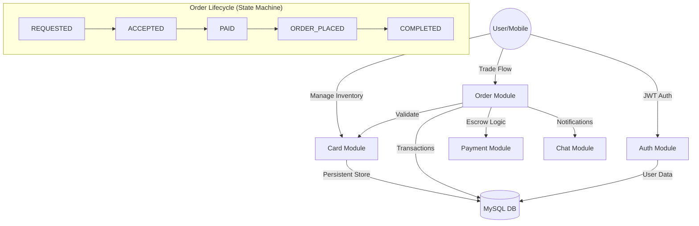

<!-- markdownlint-disable MD033 MD041 -->
<div align="center">
  <h1>💳 Cardify  </h1>
  
  <p>
    <strong>A production-ready Modular Monolith backend for secure, structured Peer-to-Peer card trading and management.</strong>
  </p>

  <p>
    <a href="#-problem-statement">The Problem</a> •
    <a href="#-features">Features</a> •
    <a href="#-architecture">Architecture</a> •
    <a href="#-tech-stack">Tech Stack</a> •
    <a href="#-api-documentation">API Docs</a> •
    <a href="#-mobile-integration">Mobile App</a>
  </p>

  <p>
    
    
    
    
    
  </p>
</div>

---


## 📖 The Problem Statement

In the modern e-commerce landscape, **exclusive bank-specific discounts** are ubiquitous. Platforms like Amazon, Flipkart, and others frequently offer significant price drops—but only for holders of specific credit or debit cards (e.g., HDFC, ICICI, or SBI).

This creates a **digital divide**:
1. **Missed Savings**: Millions of users miss out on deep discounts simply because they don't own the "right" card at the right time.
2. **Security Risks**: Users often resort to unsafe, unverified P2P arrangements on social media to "borrow" a card, risking their money or sensitive data.
3. **Sharing Friction**: Card owners have no safe, structured way to help others and earn a small commission without exposing their private card details.

## 💡 The Cardify Solution

**Cardify** is a specialized platform that bridges this gap by connecting **Buyers** looking for offers with **Card Owners** who can provide them.

- **Zero Information Leak**: Owners never share sensitive card details; they perform the transaction themselves on the e-commerce platform.
- **Escrow-Backed Trust**: Buyers pay securely into the Cardify platform. Funds are only released to the Owner once the Buyer confirms the item has been delivered.
- **Mutual Benefit**: Buyers save money through exclusive offers, and Owners earn a structured commission for their assistance.
- **Complete Lifecycle Tracking**: From the initial request to the final delivery confirmation, every step is governed by a secure, real-time state machine.

---

## 📱 Cardify Mobile Application

The Cardify ecosystem is designed for mobility. While this repository powers the engine, the user experience lives in the native mobile application.

<p align="center">
<a href="https://github.com/Mahir-Agarwal/Cardify-ClientSide">

</a>
</p>

### 🔗 Integration Flow
1. **Browse & Search**: Users search for available cards via the Mobile UI.
2. **Secure Auth**: Handled via stateless JWT tokens issued by this backend.
3. **Real-time Lifecycle**: Mobile clients poll or receive updates as orders move from `REQUESTED` to `COMPLETED`.
4. **Direct Channel**: Owners can manage their inventory and respond to requests directly from their device.

---

## 🏗️ Architecture: The Modular Monolith

Unlike a traditional "spaghetti" monolith or an over-engineered microservices setup, Cardify uses a **Domain-Driven Modular Monolith** approach. Each feature is a self-contained module, making it easy to split into microservices in the future.

### 🔄 System Logic Flow


---

## ✨ Key Features

<table>
  <tr>
    <td width="50%">
      <h3>🛡️ Structured Escrow</h3>
      <ul>
        <li><strong>State Machine</strong>: Strict enforcement of the order lifecycle.</li>
        <li><strong>Ownership Validation</strong>: Users cannot modify resources they don't own.</li>
        <li><strong>Payment Simulation</strong>: Realistic handling of buyer deposits and owner payouts.</li>
      </ul>
    </td>
    <td width="50%">
      <h3>🔍 Smart Discovery</h3>
      <ul>
        <li><strong>Paginated Search</strong>: High-performance SQL queries for card filtering.</li>
        <li><strong>My Cards</strong>: Dedicated inventory management for card owners.</li>
        <li><strong>Auto-Promotion</strong>: Buyers who list a card are automatically upgraded to Owners.</li>
      </ul>
    </td>
  </tr>
  <tr>
    <td width="50%">
      <h3>💬 Trade Continuity</h3>
      <ul>
        <li><strong>Integrated Chat</strong>: Every order has its own messaging context.</li>
        <li><strong>Soft Deletion</strong>: Cards aren't just "erased"—they are deactivated to maintain history.</li>
        <li><strong>Auditing</strong>: Automated timestamps for every entity creation and update.</li>
      </ul>
    </td>
    <td width="50%">
      <h3>🏢 Enterprise Security</h3>
      <ul>
        <li><strong>Stateless JWT</strong>: Secure, scalable authentication without server-side sessions.</li>
        <li><strong>Global Exception Handling</strong>: Unified error codes (e.g., <code>UNAUTHORIZED_ACCESS</code>) for front-end clarity.</li>
        <li><strong>CORS & 0.0.0.0 Binding</strong>: Configured for seamless local network testing with mobile devices.</li>
      </ul>
    </td>
  </tr>
</table>

---

## 🛠️ Tech Stack

| Component | Technology | Description |
| :--- | :--- | :--- |
| **Framework** | Spring Boot 3.4.x | Core framework with Java 17. |
| **Database** | MySQL 8.0 | Reliable, local persistence for users and orders. |
| **API Layer** | Spring Web | RESTful controllers with structured DTO responses. |
| **Documentation** | Swagger / OpenAPI 3 | Automatically generated interactive API UI. |
| **Persistence** | Spring Data JPA | Repository abstraction with Hibernate. |
| **Security** | Spring Security 6 | JWT-based role protection (BUYER, OWNER). |
| **Utilities** | Lombok | Boilerplate reduction for DTOs and Entities. |

---

## 📂 Project Structure

The project follows a clean **package-by-feature** modular structure:

```bash
src/main/java/in/sp/main
├── auth/            # Registration, Login, Token generation logic
├── user/            # User profiles and role management
├── card/            # Card inventory, search, and soft-delete logic
├── order/           # The core Order state machine and lifecycle
├── payment/         # Escrow simulation and transaction logging
├── chat/            # Order-specific messaging modules
├── review/          # Buyer/Owner rating and feedback system
└── core/            # Universal logic (Security, Exceptions, BaseEntity)
```

---

## 📚 API Documentation

### 🔑 Core State Transitions

| Method | Endpoint | Transition | Role |
| :--- | :--- | :--- | :--- |
| `POST` | `/api/orders/request` | `START` ➡️ `REQUESTED` | Buyer |
| `PUT` | `/api/orders/{id}/accept` | `REQUESTED` ➡️ `ACCEPTED` | Owner |
| `POST` | `/api/orders/{id}/pay` | `ACCEPTED` ➡️ `PAID` | Buyer |
| `PUT` | `/api/orders/{id}/place` | `PAID` ➡️ `ORDER_PLACED` | Owner |
| `PUT` | `/api/orders/{id}/confirm`| `PLACED` ➡️ `COMPLETED` | Buyer |

**Interactive Swagger UI:** 
Available locally at `http://[YOUR_IP]:8080/swagger-ui/index.html`

---

<div align="center">
  <p>
    <sub> Engineered and Developed by <a href="https://github.com/Mahir-Agarwal">Mahir Agarwal</a></sub>
  </p>
</div>
